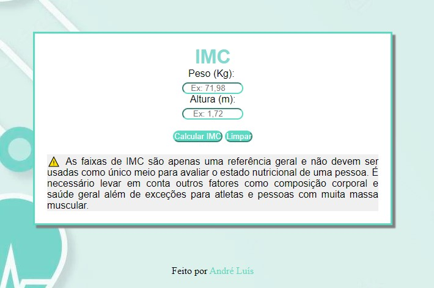

<h1 align="center"> Calculadora IMC</h1>

Na trajetória do estudo em JavaScript, HTML e CSS decidi criar uma calculadora do Indice Massa Corporal, para praticar os conceitos de condições, modal, funções, responsividade da página, estilização e alteração do DOM com o JavaScript.  

  <a href="#-tecnologias">Tecnologias</a>&nbsp;&nbsp;&nbsp;|&nbsp;&nbsp;&nbsp;
  <a href="#-projeto">Projeto</a>&nbsp;&nbsp;&nbsp;|&nbsp;&nbsp;&nbsp;
  <a href="#-ToDo">ToDo</a>&nbsp;&nbsp;&nbsp;|&nbsp;&nbsp;&nbsp;
  <a href="#memo-licença">Licença</a>

  

 

  

## 🚀 Tecnologias

Esse projeto foi desenvolvido com as seguintes tecnologias:

- JavaScript
- HTML
- CSS

## 💻 Projeto

O projeto é uma aplicação para calcular o Indice de Massa Corporal (IMC), com base nos valores informados pelo usuario. O mesmo é capaz de validar as informações inseridas e apresentar um modal de advertência para o usuário quando os valores não forem válidos. Além de apresentar os resultados de forma dinâmina na página.

- [Faça o teste](https://tiotedd.github.io/caculadoraIMC/)

## :spiral_notepad: ToDo

- Utilizar uma API para indicar nutriionistas próximos ao local

## :memo: Licença

Esse projeto está sob a licença MIT.

---

Feito com ♥ e esforço rsrsr
